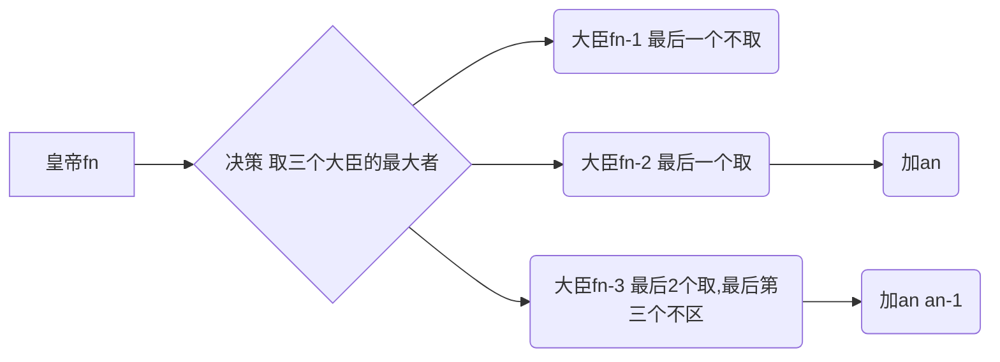

[TOC]

  ## 动态规划之取数

### 2254: 【提高】取数

#### 题目描述
从n个数中取出若干个数，可以连续取1个，也可以连续取2个，但连续取的数不能有3个或多于3个。问取到的最大的和是多少？

#### 输入
第1行：一个整数n（1<=n<=10000）。
第2行：空格隔开的n个整数ai（1<=ai<=100000）。

#### 输出
一行，1个整数，表示取到的最大和。

####  样例输入 
5
1 3 2 4 5
####  样例输出

13

####  提示[-]
取1 3 4 5四个数，和为13。

####  来源链接
武进区第7届程序设计比赛题（小学）[点我](http://oj.jzxx.net/problem.php?id=2254 )

### 思路




> 最后一个不取 f(n-1) 
> 最后一个取，最后第二个不取，f[n-2]+a[n]，最后第二个是废掉的
> 最后两个取，最后第3个不取， f[n-3]+a[n]+a[n-1]，最后第3个是废掉的
> f[0]=0
> f[1]=a[1]
> f[2]=a[2]+a[1]
> f[3]=max(f[2],f[1]+a[3],a[3]+a[2]+f[0])

### 代码

```c++
#include<iostream>
#include<cmath>
using namespace std;
long long n,a[100005],h,mm[100005];
long long f(long long n)
{
	if(mm[n]!=0) return mm[n];
	if(n<=0) return 0;
	if(n==1) return a[1];
	if(n==2) return a[2]+a[1];
	mm[n]=max(f(n-2)+a[n],f(n-3)+a[n]+a[n-1]);
	mm[n]=max(mm[n],f(n-1));
	return mm[n];
}
int main()
{
	cin>>n;
	for(int i=1;i<=n;i++)
		cin>>a[i];
	h=f(n);
	cout<<h;
	return 0;
}
```
