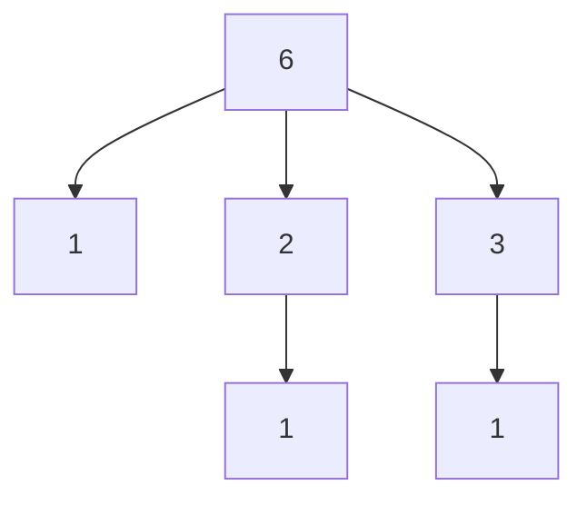
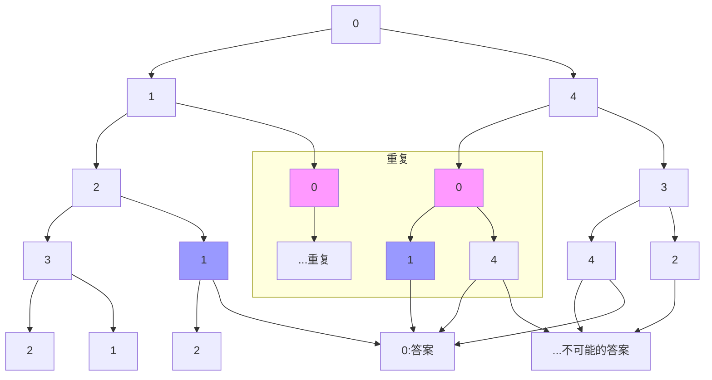

[TOC]

# 搜索入门

## 隐含搜索树的搜索
### 	搜索树是一种特殊的DAG（有向无环图）有些可以用动态规划进行优化

----------

### 1562: 【NOIP01普及组】数的计数

**题目描述**
我们要求找出具有下列性质数的个数(包含输入的自然数n): 先输入一个自然数n（n≤1000）, 然后对此自然数按照如下方法进行处理： 1．不作任何处理； 2．在它的左边加上一个自然数，但该自然数不能超过原数的一半； 3．加上数后，继续按此规则进行处理，直到不能再加自然数为止。

**输入**
一行，一个整数。

**输出**
一行，一个整数，即具有上述性质的数的个数。

**样例输入** 
6
**样例输出 **
6
提示[-]
满足条件的数为 6 16 26 126 36 136

### 难度

2星

### 思路

1. 搜索的思路

   f\(6)=1+f(1)+f(2)+f(3)=6  //解释：皇帝大臣f（6）的答案来自本身1，大臣f（1）、大臣f（2）、大臣f（3）

   f(2)=1+f(1)=2

   f(1)=1

   f(3)=1+f(1)=2

2. 动态规划的思路

   f[1]=1

   f[2]=1+f[1]=2

   f[3]=1+f[1]=2

   f[4]=1+f[1]+f[2]=4 //这里可以看出第四阶段想要知道答案的话，来自1本身和f[2]，而f[2]在前面已经知道答案了

   ……

   前面是4个阶段

   决策是做加法运算   

### 代码
   1. 递归

      ```c++
      #include<iostream>
      using namespace std;
      int n;
      int f(int x){
      	int sum=1;
      	if(x==1) return 1;
      	for(int i=1;i<=x/2;i++){
      		sum+=f(i);
      	}
      	return sum;
      }
      int main(){
      	cin>>n;
      	cout<<f(n);
      	return 0;
      }
      ```

   2. 记忆化优化

      ```c++
      #include<iostream>
      using namespace std;
      int n,mm[1000005];
      int f(int x){
      	if(mm[x]>0) return mm[x];
      	int sum=1;
      	if(x==1) return 1;
      	for(int i=1;i<=x/2;i++){
      		sum+=f(i);
      	}
      	mm[x]=sum;
      	return sum;
      }
      int main(){
      	cin>>n;
      	cout<<f(n);
      	return 0;
      }
      ```

      2、动态规划（多阶段决策问题）

      ```c++
      #include<iostream>
      using namespace std;
      int n,f[10005];
      int main(){
      	cin>>n;
      	f[1]=1;
      	for(int i=2;i<=n;i++){
      		f[i]=1;
      		for(int j=1;j<=i/2;j++){
      			f[i]+=f[j];
      		}
      	}
      	cout<<f[n];
      	return 0;
      }
      ```

      

### 1735: 【NOIP08普及组】传球游戏

**题目描述**
上体育课的时候，小蛮的老师经常带着同学们一起做游戏。这次，老师带着同学们一起做传球游戏。 
游戏规则是这样的：n个同学站成一个圆圈，其中的一个同学手里拿着一个球，当老师吹哨子时开始传球，每个同学可以把球传给自己左右的两个同学中的一个（左右任意），当老师再次吹哨子时，传球停止，此时，拿着球没传出去的那个同学就是败者，要给大家表演一个节目。 
聪明的小蛮提出一个有趣的问题：有多少种不同的传球方法可以使得从小蛮手里开始传的球，传了m次以后，又回到小蛮手里。两种传球的方法被视作不同的方法，当且仅当这两种方法中，接到球的同学按接球顺序组成的序列是不同的。
比如有3个同学1号、2号、3号，并假设小蛮为1号，球传了3次回到小蛮手里的方式有1->2->3->1和1->3->2->1，共2种。

**输入**
共一行，有两个用空格隔开的整数n，m（3<=n<=30，1<=m<=30）。

**输出**
共一行，有一个整数，表示符合题意的方法数。

**样例输入**
3 3
**样例输出 **
2
40%的数据满足：3<=n<=30，1<=m<=20 

100%的数据满足：3<=n<=30，1<=m<=30
### 难度
3星

### 思路
1. 搜索的思路

假设有5个人，传4次,答案是6

0-->1-->2-->1-->0

0-->1-->0-->1-->0

0-->1-->0-->4-->0

0-->4-->0-->1-->0

0-->4-->0-->4-->0

0-->4-->3-->4-->0

在递归的过程中，我们会发现有些点是重复了。


2. 动态规划的思路(分阶段决策问题)

   我们可以用f\[开始点序号]\[结束点序号]\[还剩下的步数]=方案数

   我们发现“结束点序号”始终是0，所以可以缩减成二维的，而不用三维

   第一阶段

   和递归的思路类似，从0出发，走0步，就是回到当前的地方，f\[ 0 ][ 0 ] = 1

   第二阶段

   再思考只有1步可以走的情况f\[1][1]=1，f\[n-1][1]=1 

   后面的阶段

   再思考有2步可以走的情况

   ```c++
   f[k][i]=f[(k+1)%n][i-1]+f[(k-1+n)%n][i-1];
   ```

   决策：就是左右两个相邻的答案相加

### 容易搞错的地方及编程技巧

1. mm[][]数组初始化为-1，因为答案会是0出现，如果默认是0会超限
```c++
//...
if(mm[st][k]>=0) return mm[st][k];
//...
memset(mm,255,sizeof(mm));
//...
```
2. 从0出发，最后到0；从0出发可以用%求余，当出现负数的时候，要先加n，弥补一下。

```c++
int ans1=f((st-1+n)%n,k-1);
```
### 代码
1. 递归
```c++
#include<bits/stdc++.h>
using namespace std;
int n,m;
int f(int st,int k){//从st出发，还有k步可以用
	if(k==0){
		if(st==0) return 1;
		else return 0;
	} 
	int ans1=f((st-1+n)%n,k-1);
	int ans2=f((st+1)%n,k-1);
	return ans1+ans2;
}
int main(){
	cin>>n>>m;
	cout<<f(0,m);
	return 0;
}
```
2. 记忆化优化
```c++
#include<bits/stdc++.h>
using namespace std;
long long n,m,mm[40][40];
long long f(long long st,long long k){
	if(k==0){
		if(st==0) {
			mm[st][k]=1;
			return 1;
		}
		else {
			mm[st][k]=0;
			return 0;
		}
	} 
	if(mm[st][k]>=0) return mm[st][k];
	long long ans1=f((st-1+n)%n,k-1);
	long long ans2=f((st+1)%n,k-1);
	mm[st][k]=ans1+ans2;
	return mm[st][k];
}
int main(){
	memset(mm,255,sizeof(mm));
	cin>>n>>m;
	cout<<f(0,m);
	return 0;
}
```

3. 动态规划

   用三维数组来描述问题更加清晰

   ```c++
   #include<iostream>
   using namespace std;
   int n,m,f[105][105][105];
   int main(){
   	cin>>n>>m;
   	f[0][0][0]=1; //从0开始，到0结束，还剩0步，有1种方案
   	for(int step=1;step<=m;step++){
   		for(int i=0;i<n;i++){
   			f[i][0][step]=f[(i-1+n)%n][0][step-1]+f[(i+1)%n][0][step-1];
   		}
   	}
   	cout<<f[0][0][m];
   	return 0;
   }
   ```

   可以优化成二维数组

   ```c++
   #include<iostream>
   using namespace std;
   int f[40][40],n,m;
   int main(){
   	cin>>n>>m;
   	f[0][0]=1;// 从0开始，走0步，到达0，有1种可能性
   	for(int i=1;i<=m;i++){
   		for(int k=0;k<=n-1;k++)
   			f[k][i]=f[(k+1)%n][i-1]+f[(k-1+n)%n][i-1];
   	}
   	cout<<f[0][m]<<endl;
   	return 0;
   }
   ```

   ###### 严科磊 13777145451 宁波